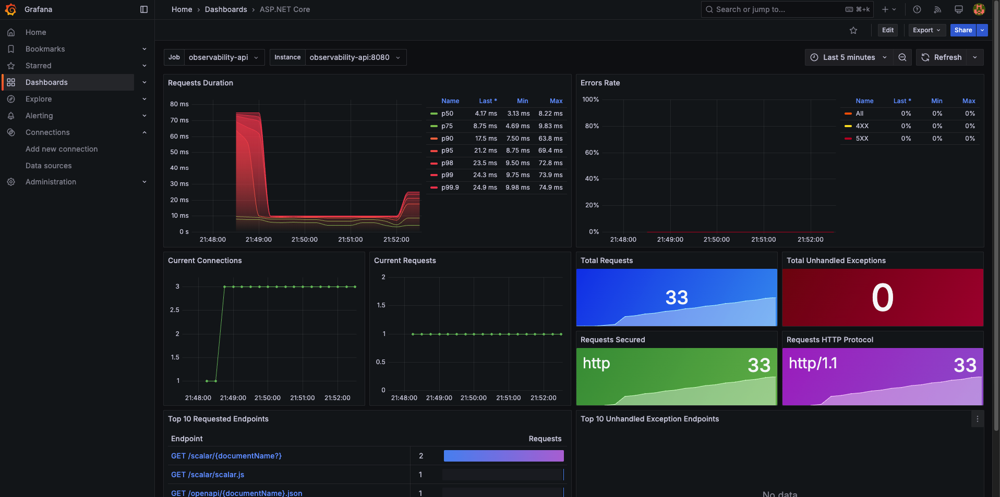
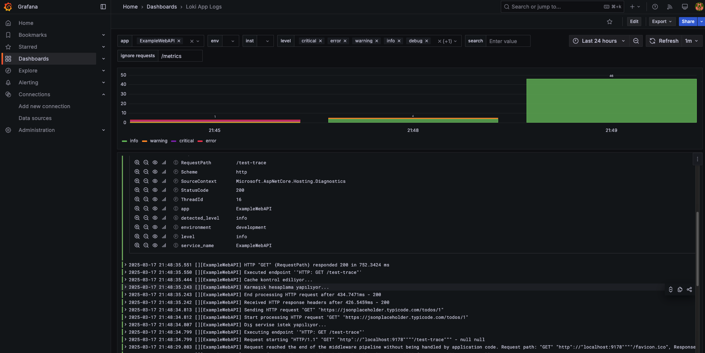
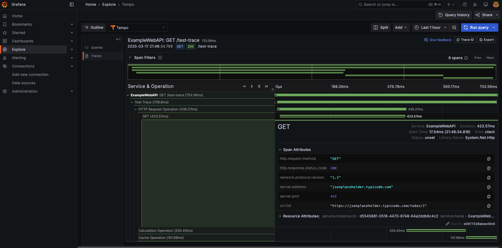
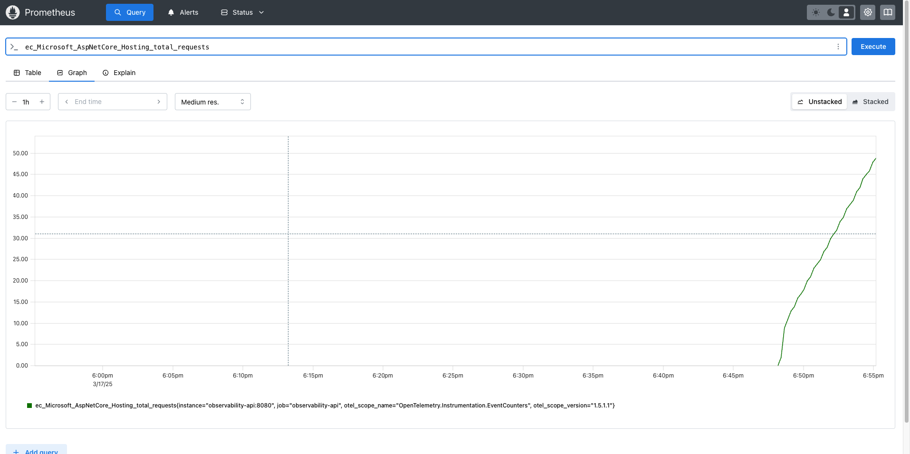

# **Observability Rehberi: Grafana, Loki, Tempo ve Prometheus**

## **🔍 OpenTelemetry Nedir?**

**OpenTelemetry (OTel)**, dağıtılmış sistemlerde **telemetri verilerini (tracing, metrics, logs) toplamak** ve birden fazla backend sistemine göndermek için kullanılan **açık kaynaklı bir gözlemlenebilirlik çerçevesidir**.  
Prometheus, Grafana Tempo, Jaeger ve diğer sistemlerle entegrasyon sağlar.  

### **🚀 OpenTelemetry Bileşenleri**

1. **Tracing (İzleme)**: Servisler arası isteklerin nasıl ilerlediğini takip eder.
2. **Metrics (Metrikler)**: Uygulamanın performansını ölçen zaman serisi verilerini toplar.
3. **Logging (Loglama)**: Uygulamanın içindeki olayları detaylı olarak kaydeder.

---

## **🎛 OpenTelemetry Instrumentation'ları Nelerdir?**

**Instrumentation**, uygulamaların otomatik olarak telemetri verisi üretmesini sağlayan **ara katman kütüphaneleridir**.

### **📌 .NET Core'da OpenTelemetry Instrumentation'ları**

| **Instrumentation** | **Açıklama** |
|----------------------|-------------|
| **AspNetCore** | HTTP isteklerini ve yanıt sürelerini ölçer. |
| **HttpClient** | API çağrılarını ve istek sürelerini izler. |
| **EntityFrameworkCore** | Veritabanı sorgularını takip eder. |
| **System.Runtime** | Bellek, çöp toplama (GC) ve CPU kullanım verilerini toplar. |
| **System.Diagnostics.Metrics** | Özel metrikler tanımlamak için kullanılır. |

### **📌 .NET Core OpenTelemetry Kullanımı**

```csharp
// OpenTelemetry yapılandırması
        builder.Services.AddOpenTelemetry()
        .WithTracing(tracerProvider =>
        {
            tracerProvider
                .AddSource(activitySource.Name)
                .SetResourceBuilder(ResourceBuilder.CreateDefault()
                    .AddService("ExampleWebAPI")
                    .AddTelemetrySdk()
                    .AddEnvironmentVariableDetector())
                .AddAspNetCoreInstrumentation(options =>
                {
                    options.Filter = null; // Tüm istekleri kaydet

                    options.RecordException = true;
                })
                .AddHttpClientInstrumentation(options =>
                {
                    options.RecordException = true;
                })
                .AddConsoleExporter()
                .AddOtlpExporter(opts =>
                {
                    opts.Endpoint = new Uri("http://observability-tempo:4317"); // Tempo OTLP gRPC endpoint
                    opts.Protocol = OtlpExportProtocol.Grpc; // GRPC protokolünü kullan
                });
        })
        .WithMetrics(metrics =>
        {
            metrics
                .SetResourceBuilder(ResourceBuilder.CreateDefault().AddService("MyMetricService"))
                .AddAspNetCoreInstrumentation() // HTTP request metrikleri
                .AddHttpClientInstrumentation() // HTTP client metrikleri
                .AddProcessInstrumentation() // İşlem bazlı metrikler (CPU, memory)
                .AddRuntimeInstrumentation() // .NET runtime metrikleri
                .AddMeter("System.Runtime") // .NET Runtime metrikleri için gerekli.. // GC süresi, bellek kullanımı, CPU yükü
                .AddMeter("System.Threading") // Thread havuzu metrikleri
                .AddMeter("Custom.Http.Meter")
                .AddEventCountersInstrumentation(options =>
                {
                    // HTTP istek ve bağlantı metrikleri
                    options.AddEventSources("System.Net.Http"); // HTTP istemci istek sayısı
                    options.AddEventSources("System.Net.Sockets"); // TCP bağlantıları
                    options.AddEventSources("System.Net.NameResolution"); // DNS istekleri
                    
                    // ASP.NET Core metrikleri
                    options.AddEventSources("Microsoft.AspNetCore.Hosting"); // Request süreleri
                    options.AddEventSources("Microsoft.AspNetCore.Http.Connections"); // WebSocket ve SignalR metrikleri
                })
                .AddConsoleExporter() // Konsola yazdırma
                .AddPrometheusExporter(); // Prometheus exporter'ı ekle
        });
```

👉 **Bu ayarlar sayesinde OpenTelemetry, uygulamanın tracing, metrik ve loglarını otomatik olarak toplayarak uygun backend sistemlerine (Tempo, Prometheus, Loki) aktarır.**

---

## **1️⃣ Grafana Nedir?**

**Grafana**, metrikleri, logları ve izleme verilerini görselleştirmek için kullanılan bir açık kaynaklı izleme platformudur.  
Verileri **Prometheus, Loki, Tempo gibi sistemlerden çeker** ve bunları **dashboard’lar ile sunar**.

### **📌 Docker Compose ile Grafana Nasıl Eklenir?**

```yaml
services:
  observability-grafana:
    image: grafana/grafana:latest
    container_name: observability-grafana
    ports:
      - "9190:3000" # 3000 dış port yerine 9190 kullanıldı
    networks:
      - observability-example-network
    volumes:
      - .deploy/grafana:/var/lib/grafana
      - .deploy/grafana/provisioning:/etc/grafana/provisioning
    environment:
      - GF_SECURITY_ADMIN_PASSWORD=admin
      - GF_AUTH_ANONYMOUS_ENABLED=true
```

👉 **Grafana’yı `http://localhost:9190` üzerinden açabilirsin.**  



---

## **2️⃣ Loki Nedir?**

**Loki**, merkezi bir log yönetim sistemidir. **Promtail ile logları toplayıp Grafana üzerinden görselleştirmeye olanak tanır.**  
Grafana Loki’yi kullanarak sistem loglarını analiz edebiliriz.



### **📌 Docker Compose ile Loki Nasıl Eklenir?**

```yaml
services:
  observability-loki:
    image: grafana/loki:latest
    container_name: observability-loki
    ports:
      - "9182:3100"
    networks:
      - observability-example-network
    volumes:
      - .deploy/loki:/loki
      - .deploy/loki/loki-config.yaml:/etc/loki/local-config.yaml
```

👉 **Loki’ye Promtail veya Fluentd gibi log toplayıcıları bağlamalısın.**

### **📌 Loki `Program.cs` ve `appsettings.json` Konfigürasyonu**

#### **appsettings.json**

```json
"Serilog": {
  "Using": [ "Serilog.Sinks.Console", "Serilog.Sinks.Loki" ],
  "MinimumLevel": "Information",
  "WriteTo": [
      {
        "Name": "GrafanaLoki",
        "Args": {
          "uri": "http://observability-loki:3100",
          "labels": [
            {
              "key": "app",
              "value": "ExampleWebAPI"
            },
            {
              "key": "environment",
              "value": "development"
            }
          ],
          "propertiesAsLabels": ["RequestId", "RequestPath"]
        }
      }
  ]
}
```

#### **Program.cs**

```csharp
        builder.Host.UseSerilog((context, loggerConfig) => loggerConfig.ReadFrom.Configuration(context.Configuration));


        // OpenTelemetry Logging (Uygulama loglarını OpenTelemetry ile entegre eder)
        builder.Logging.AddOpenTelemetry(options =>
        {
            // Log scope'larını (kapsamlarını) dahil eder. 
            // Örneğin, bir request sırasında oluşturulan kapsamlı logları takip etmeye yarar.
            options.IncludeScopes = true;

            // Log mesajlarının işlenmiş (formatlanmış) halini dahil eder.
            // Örneğin, içinde değişkenler olan bir log mesajını doğrudan kaydetmeyi sağlar.
            options.IncludeFormattedMessage = true;

            // Log state'lerini ayrıştırarak (parse ederek) OpenTelemetry'de kullanılabilir hale getirir.
            // Örneğin, structured logging formatında logları işlemeye yardımcı olur.
            options.ParseStateValues = true;
        });
```

---

## **3️⃣ Tempo Nedir?**

**Tempo**, dağıtılmış izleme (tracing) için kullanılan bir sistemdir.  
**OpenTelemetry, Jaeger ve Zipkin gibi sistemlerden gelen tracing verilerini saklar ve analiz eder.**



### **📌 Docker Compose ile Tempo Nasıl Eklenir?**

```yaml
services:
  observability-tempo:
    image: grafana/tempo:latest
    container_name: observability-tempo
    ports:
      - "9184:3200"
      - "9186:9411"
    networks:
      - observability-example-network
    volumes:
      - .deploy/tempo:/tempo
      - .deploy/tempo/tempo-config.yaml:/etc/tempo.yaml
    expose:
      - "4317" # OTLP gRPC bağlantısı için
      - "4318" # OTLP HTTP bağlantısı için
```

👉 **Tempo’yu Grafana ile bağlayarak tracing verilerini görselleştirebilirsin.**

### **📌 Tempo `Program.cs` Konfigürasyonu**

```csharp
builder.Services.AddOpenTelemetry()
    .WithTracing(tracing =>
    {
        tracing
            .AddSource(activitySource.Name)
            .SetResourceBuilder(ResourceBuilder.CreateDefault()
            .AddService("ExampleWebAPI")
            .AddTelemetrySdk()
            .AddEnvironmentVariableDetector())
            .AddAspNetCoreInstrumentation()
            .AddHttpClientInstrumentation()
            .AddConsoleExporter()
            .AddOtlpExporter(opts =>
            {
                opts.Endpoint = new Uri("http://observability-tempo:4317");
                opts.Protocol = OtlpExportProtocol.Grpc;
            });
    });
```

---

## **4️⃣ Prometheus Nedir?**

**Prometheus**, metrikleri toplayan ve sorgulayan bir sistemdir.  
Grafana ile birlikte kullanılarak **sistem performansını izlemek ve alarmlar oluşturmak için idealdir.**



### **📌 Docker Compose ile Prometheus Nasıl Eklenir?**

```yaml
services:
  observability-prometheus:
    image: prom/prometheus:latest
    container_name: observability-prometheus
    ports:
      - "9188:9090"
    networks:
      - observability-example-network
    volumes:
      - .deploy/prometheus:/prometheus
      - .deploy/prometheus/prometheus.yml:/etc/prometheus/prometheus.yml
```

👉 **Prometheus metriklerini görmek için:** `http://localhost:9188`

### **📌 Prometheus `Program.cs` Konfigürasyonu**

```csharp
builder.Services.AddOpenTelemetry()
    .WithMetrics(metrics =>
    {
        metrics
                .SetResourceBuilder(ResourceBuilder.CreateDefault().AddService("MyMetricService"))
                .AddAspNetCoreInstrumentation() // HTTP request metrikleri
                .AddHttpClientInstrumentation() // HTTP client metrikleri
                .AddProcessInstrumentation() // İşlem bazlı metrikler (CPU, memory)
                .AddRuntimeInstrumentation() // .NET runtime metrikleri
                .AddMeter("System.Runtime") // .NET Runtime metrikleri için gerekli.. // GC süresi, bellek kullanımı, CPU yükü
                .AddMeter("System.Threading") // Thread havuzu metrikleri
                .AddMeter("Custom.Http.Meter")
                .AddEventCountersInstrumentation(options =>
                {
                    // HTTP istek ve bağlantı metrikleri
                    options.AddEventSources("System.Net.Http"); // HTTP istemci istek sayısı
                    options.AddEventSources("System.Net.Sockets"); // TCP bağlantıları
                    options.AddEventSources("System.Net.NameResolution"); // DNS istekleri
                    
                    // ASP.NET Core metrikleri
                    options.AddEventSources("Microsoft.AspNetCore.Hosting"); // Request süreleri
                    options.AddEventSources("Microsoft.AspNetCore.Http.Connections"); // WebSocket ve SignalR metrikleri
                })
                .AddConsoleExporter() // Konsola yazdırma
                .AddPrometheusExporter(); // Prometheus exporter'ı ekle
    });

app.UseOpenTelemetryPrometheusScrapingEndpoint();
```

---

## **🎯 Sonuç**

| **Bileşen**  | **Açıklama** | **Bağlantı** |
|--------------|-------------|-------------|
| **Grafana** | Verileri görselleştirir | `http://localhost:9190` |
| **Loki** | Log yönetim sistemi | `http://localhost:9182` |
| **Tempo** | Tracing (dağıtılmış izleme) | `http://localhost:9184` |
| **Prometheus** | Metrik toplama ve analiz | `http://localhost:9188` |

🚀 **Bu rehberi takip ederek Observability sistemini eksiksiz bir şekilde Docker Compose ve .NET Core ile çalıştırabilirsin.**
