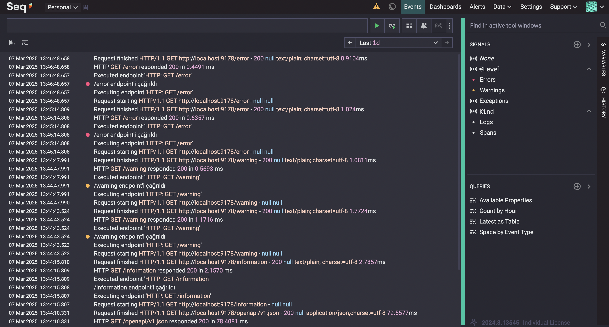
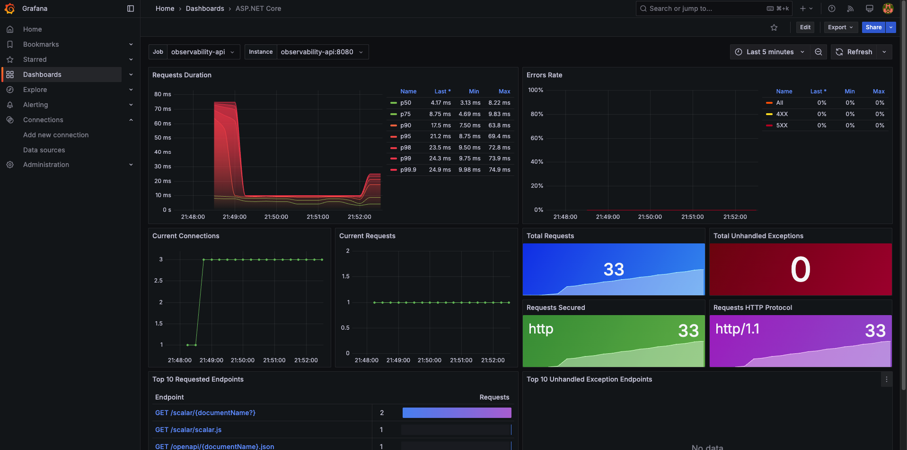
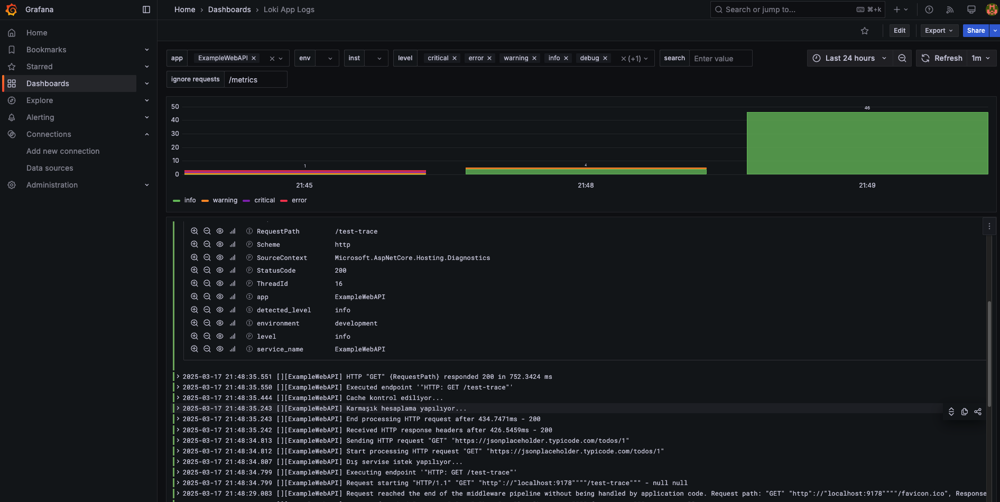
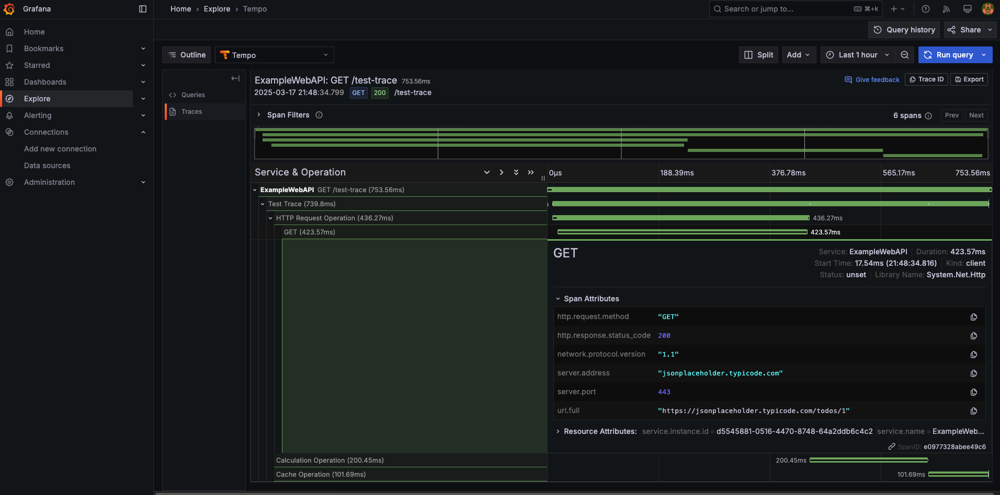
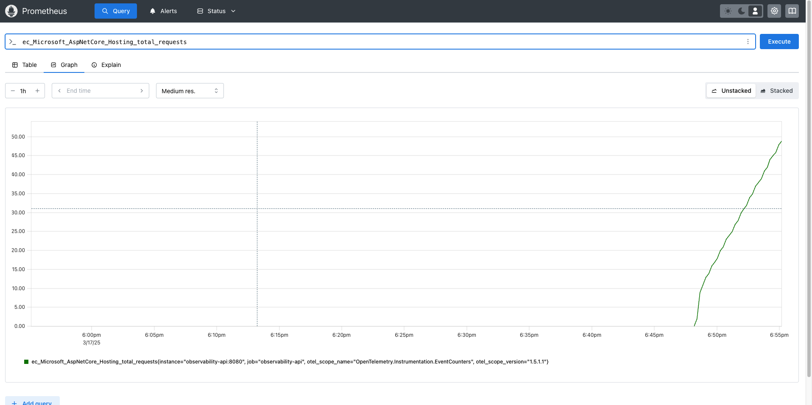

# Observability - Gözlemlenebilirlik

## OpenTelemetry Nedir?

OpenTelemetry, uygulama gözlemlenebilirliğini sağlamak için kullanılan açık kaynaklı bir standarttır. **Tracing (izleme)**, **Metrics (ölçümler)** ve **Logging (loglama)** gibi gözlemlenebilirlik bileşenlerini tek bir çatı altında toplar.

OpenTelemetry sayesinde uygulamanın performansını, hatalarını ve genel çalışma durumunu merkezi bir sistem üzerinden takip etmek mümkün olur. **Serilog, Grafana, Prometheus, Loki, Tempo** gibi gözlemlenebilirlik araçlarıyla entegre çalışabilir.

## Serilog Nedir?

Serilog, .NET platformu için geliştirilmiş, yapılandırılmış log kayıtları oluşturmaya odaklanmış güçlü bir loglama kütüphanesidir. Geleneksel string formatlamalı loglar yerine, Serilog structured (yapılandırılmış) loglama yaklaşımını benimser.

Serilog'un avantajları:
- JSON formatında yapılandırılmış loglar tutabilir.
- Konsol, dosya, veri tabanı, Seq gibi çeşitli hedeflere log yazabilir.
- Minimum performans kaybı ile çalışır.

**Serilog kurulumu ve kullanımı ile ilgili detaylı bilgi için** [Serilog ve Seq ile .NET Uygulamalarında Yapılandırılmış Loglama](./SerilogSeq.md) **makalesine göz atabilirsiniz.**

## Grafana, Loki, Tempo ve Prometheus Nedir?

- **Grafana**: Gözlemlenebilirlik verilerini görselleştirmek için kullanılan açık kaynaklı bir dashboard aracıdır. Prometheus, Loki, Tempo ve OpenTelemetry gibi sistemlerden veri çekerek anlamlı grafikler oluşturur.
  

- **Loki**: Log verilerini merkezi bir şekilde saklayan ve sorgulayan log yönetim sistemidir. Serilog gibi log sağlayıcılarıyla entegre olarak çalışır.
  

- **Tempo**: OpenTelemetry ile izlenen dağıtık izleme (distributed tracing) verilerini saklayan ve analiz eden bir araçtır.

- **Prometheus**: Zaman serisi verilerini toplayan ve analiz eden güçlü bir monitoring ve metrik toplama sistemidir.

**Bu araçların kurulumu ve detaylı bilgileri için** [Grafana, Loki, Tempo ve Prometheus Kurulumu](./Grafana.Md) **makalesine göz atabilirsiniz.**
